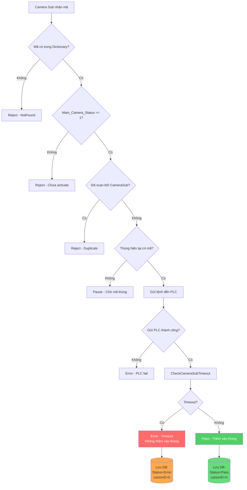

# Cơ Chế Loại Bỏ Chai Bị Timeout

## Mục Lục
1. [Tổng Quan](#1-tổng-quan)
2. [Luồng Xử Lý Camera Sub](#2-luồng-xử-lý-camera-sub)
3. [Hàm CheckCameraSubTimeout](#3-hàm-checkcamerasubtimeout)
4. [Cấu Hình Timeout](#4-cấu-hình-timeout)
5. [Lưu Trữ Database](#5-lưu-trữ-database)
6. [Cách Query Dữ Liệu Timeout](#6-cách-query-dữ-liệu-timeout)
7. [Sơ Đồ Flow](#7-sơ-đồ-flow)

---

## 1. Tổng Quan

Hệ thống có cơ chế phát hiện và loại bỏ chai bị timeout tại **Camera Sub** (Camera phụ) dựa trên việc **polling đếm số pass từ PLC**.

### Nguyên lý hoạt động:
- Sau khi gửi lệnh pass/reject đến PLC, hệ thống sẽ liên tục đọc counter từ PLC
- Nếu pass count **tăng** → PLC đã xử lý thành công
- Nếu pass count **không tăng** trong thời gian timeout → Chai bị timeout, loại bỏ

### File source code chính:
- `Views/Dashboards/FDashboard.cs` - Chứa logic xử lý timeout
- `Production/ProductionHelper.cs` - Chứa logic lưu database

---

## 2. Luồng Xử Lý Camera Sub

### 2.1 Quy trình xử lý `CameraSub_Process()` (dòng 376-668)

```
Camera Sub nhận mã
       ↓
Kiểm tra mã trong Dictionary
       ↓
Kiểm tra Main_Camera_Status == "1" (đã kích hoạt từ Camera Main)
       ↓
Kiểm tra duplicate trong CameraSub Dictionary
       ↓
Kiểm tra thùng hiện tại có mã không
       ↓
Gửi lệnh đến PLC (Send_To_PLC)
       ↓
[Thành công] → CheckCameraSubTimeout() → [Timeout?]
       ↓                                       ↓
   [Không Timeout]                      [Có Timeout]
       ↓                                       ↓
   Thêm vào thùng                     Loại bỏ, ghi record Error
```

### 2.2 Xử lý khi BackgroundWorker bận (dòng 131-152)

Khi `subpr.IsBusy` (BackgroundWorker đang xử lý mã khác):
- Gửi reject xuống PLC: `Send_To_PLC("PLC_Reject_DM_C1", "0")`
- Đánh dấu Error: `Send_Result_Content_CSub(e_Production_Status.Error, data)`
- Ghi record: `Enqueue_Product_To_Record(data, e_Production_Status.Error, false, ...)`

---

## 3. Hàm CheckCameraSubTimeout

### 3.1 Vị trí: Dòng 1133-1278 trong `FDashboard.cs`

### 3.2 Signature:
```csharp
public bool CheckCameraSubTimeout(string productCode, int expectedPassCountIncrease = 1)
```

### 3.3 Tham số:
| Tham số | Mô tả |
|---------|-------|
| `productCode` | Mã chai đang xử lý |
| `expectedPassCountIncrease` | Số lượng pass count mong muốn tăng (mặc định = 1) |

### 3.4 Giá trị trả về:
| Giá trị | Ý nghĩa |
|---------|---------|
| `true` | Chai bị timeout - cần loại bỏ |
| `false` | Chai xử lý thành công - thêm vào thùng |

### 3.5 Logic hoạt động:

```csharp
// Bước 1: Kiểm tra config có bật timeout không
if (!AppConfigs.Current.CameraSub_Timeout_Enabled)
    return false; // Không timeout - tính năng bị tắt

// Bước 2: Lưu snapshot counter trước khi gửi
int passCountBefore = Globals.CameraSub_PLC_Counter.total_pass;

// Bước 3: Tính số lần poll
int maxPolls = timeoutMs / pollingIntervalMs;

// Bước 4: Xác định địa chỉ PLC (hỗ trợ Duo Mode)
string plcAddress = AppConfigs.Current.PLC_Duo_Mode 
    ? PLCAddress.Get("PLC2_Total_Count_DM_C1") 
    : PLCAddress.Get("PLC_Total_Count_DM_C1");

// Bước 5: Polling loop
while (pollCount < maxPolls)
{
    // Đọc counter từ PLC
    OperateResult<int[]> readCheck = PLC.ReadInt32(plcAddress, 5);
    
    if (readCheck.IsSuccess)
    {
        int passCountCurrent = readCheck.Content[2];    // Pass count
        int timeoutCountCurrent = readCheck.Content[3]; // Timeout count
        
        // Kiểm tra pass count đã tăng chưa
        if (passCountCurrent >= passCountBefore + expectedPassCountIncrease)
        {
            return false; // SUCCESS - không timeout
        }
        
        // Kiểm tra PLC có báo timeout không
        if (timeoutCountCurrent > Globals.CameraSub_PLC_Counter.timeout)
        {
            return true; // TIMEOUT - PLC báo
        }
    }
    
    Thread.Sleep(pollingIntervalMs);
}

// Hết thời gian polling → TIMEOUT
return true;
```

### 3.6 Địa chỉ PLC được đọc:

| Index | Nội dung |
|-------|----------|
| `Content[0]` | Total count - Tổng số sản phẩm |
| `Content[1]` | Camera read fail - Số sản phẩm không đọc được |
| `Content[2]` | **Pass count - Số sản phẩm pass** |
| `Content[3]` | **Timeout count - Số sản phẩm timeout** |
| `Content[4]` | Failed count - Số sản phẩm thất bại |

---

## 4. Cấu Hình Timeout

Các config trong `AppConfigs`:

| Config | Kiểu | Mô tả |
|--------|------|-------|
| `CameraSub_Timeout_Enabled` | bool | Bật/tắt tính năng timeout |
| `CameraSub_Timeout_Ms` | int | Thời gian timeout (ms) |
| `CameraSub_Polling_Interval_Ms` | int | Khoảng thời gian giữa các lần poll (ms) |
| `CameraSub_Timeout_Log_Enabled` | bool | Bật/tắt log chi tiết timeout |
| `PLC_Duo_Mode` | bool | Chế độ 2 PLC |

### Ví dụ cấu hình:
```json
{
    "CameraSub_Timeout_Enabled": true,
    "CameraSub_Timeout_Ms": 500,
    "CameraSub_Polling_Interval_Ms": 10,
    "CameraSub_Timeout_Log_Enabled": true,
    "PLC_Duo_Mode": false
}
```

- **Số lần poll tối đa** = 500ms / 10ms = **50 lần**
- Nếu sau 50 lần poll mà pass count không tăng → **Timeout**

---

## 5. Lưu Trữ Database

### 5.1 File Database:
```
Record_CameraSub_{orderNo}.db
```

**Đường dẫn đầy đủ:**
```
C:\MasanSerialization\Databases\{yyyy-MM}\{GTIN}\Record_CameraSub_{orderNo}.db
```

### 5.2 Bảng: `Records_CameraSub`

| Cột | Kiểu | Mô tả | Giá trị khi Timeout |
|-----|------|-------|---------------------|
| `ID` | INTEGER | ID tự tăng | Auto |
| `Code` | TEXT | Mã chai | Mã chai bị timeout |
| `cartonID` | INTEGER | ID thùng | **0** |
| `Status` | TEXT | Trạng thái | **"Error"** |
| `PLC_Status` | TEXT | Trạng thái PLC | **"False"** |
| `ActivateDate` | TEXT | Thời gian xử lý | Timestamp |
| `ActivateUser` | TEXT | User đang chạy | Username |
| `ProductionDate` | TEXT | Ngày sản xuất | Production date |

### 5.3 Hàm lưu database:

**File:** `Production/ProductionHelper.cs` - Dòng 1710-1730

```csharp
public void Insert_Record_Camera_Sub(ProductionCodeData_Record record, string orderNo)
{
    string czRunPath = $"{GetOrderBasePath(orderNo)}/Record_CameraSub_{orderNo}.db";
    
    string query = @"INSERT INTO Records_CameraSub 
        (Code, cartonID, Status, PLC_Status, ActivateDate, ActivateUser, ProductionDate) 
        VALUES (@Code, @cartonID, @Status, @PLC_Status, @ActivateDate, @ActivateUser, @ProductionDate)";
    
    // Execute insert...
}
```

---

## 6. Cách Query Dữ Liệu Timeout

### 6.1 Query tất cả chai Timeout:
```sql
SELECT * FROM Records_CameraSub 
WHERE Status = 'Error'
```

### 6.2 Query chai Timeout với điều kiện chi tiết:
```sql
SELECT * FROM Records_CameraSub 
WHERE Status = 'Error' 
  AND PLC_Status = 'False' 
  AND cartonID = 0
```

### 6.3 Đếm số chai Timeout theo ngày:
```sql
SELECT DATE(ActivateDate) as Date, COUNT(*) as TimeoutCount
FROM Records_CameraSub 
WHERE Status = 'Error'
GROUP BY DATE(ActivateDate)
ORDER BY Date DESC
```

### 6.4 Query chi tiết với thời gian:
```sql
SELECT 
    Code,
    ActivateDate,
    ActivateUser,
    ProductionDate
FROM Records_CameraSub 
WHERE Status = 'Error'
  AND ActivateDate BETWEEN '2026-01-01' AND '2026-01-31'
ORDER BY ActivateDate DESC
```

---

## 7. Sơ Đồ Flow



---

## Phụ Lục

### A. Các trạng thái sản phẩm (e_Production_Status):
| Enum | Mô tả |
|------|-------|
| `Pass` | Sản phẩm OK |
| `Error` | Lỗi (bao gồm timeout) |
| `Duplicate` | Mã trùng |
| `NotFound` | Không tìm thấy mã |
| `ReadFail` | Camera không đọc được mã |

### B. Địa chỉ PLC liên quan:
| Địa chỉ Config | Mô tả |
|----------------|-------|
| `PLC_Reject_DM_C1` | Địa chỉ reject Camera Sub (PLC 1) |
| `PLC2_Reject_DM_C1` | Địa chỉ reject Camera Sub (PLC 2) |
| `PLC_Total_Count_DM_C1` | Địa chỉ counter Camera Sub (PLC 1) |
| `PLC2_Total_Count_DM_C1` | Địa chỉ counter Camera Sub (PLC 2) |

### C. Giá trị gửi PLC:
| Giá trị | Ý nghĩa |
|---------|---------|
| `0` | Reject - Loại bỏ chai |
| `1` | Pass - Phân làn lẻ |
| `2` | Pass - Phân làn chẵn |

---

**Phiên bản:** 1.0  
**Ngày tạo:** 2026-01-11  
**File nguồn:** `FDashboard.cs`, `ProductionHelper.cs`
